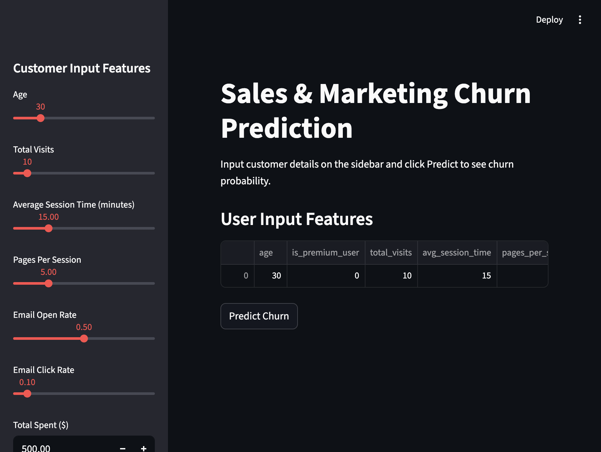

# Sales and Marketing Churn Prediction

This repository contains a Streamlit deployment for a churn prediction model built from customer sales and marketing data.

## Files

- `app.py`: Streamlit app that loads the trained model and accepts user inputs for prediction.
- `train_model.py`: Script to train the model, perform preprocessing, and save deployment artifacts.
- `requirements.txt`: Python dependencies required for both local development and Streamlit Cloud.
- `UAS_BENGKOD.ipynb`: Notebook containing the original analysis, feature engineering, and model evaluation.

## Local development

1. Install dependencies:
   ```bash
   python3 -m pip install --user -r requirements.txt
   ```

2. Make sure the dataset file is present in the project root as `Salesdataset.csv`.

3. Train the model and save deployment artifacts:
   ```bash
   python3 train_model.py
   ```

4. Run the Streamlit app:
   ```bash
   python3 -m streamlit run app.py
   ```

   If `streamlit` is not available directly in your shell, add the Python user bin directory to your `PATH`, for example:
   ```bash
   export PATH="$HOME/Library/Python/3.9/bin:$PATH"
   ```

5. Open your browser at `http://localhost:8501`.

## App preview



## Deployment to Streamlit Cloud

1. Commit all repository files to a GitHub repository.
2. Make sure `requirements.txt` is present at the repo root.
3. Use Streamlit Cloud to deploy the app by connecting your GitHub repo.
4. Set the entry point to `app.py` if prompted.

## Notes

- The app expects the files `best_voting_model.pkl`, `scaler.pkl`, and `model_columns.pkl` to be available in the repository root.
- If the artifacts are not present, run `python train_model.py` after adding `Salesdataset.csv`.
